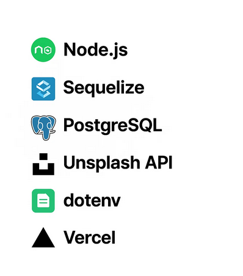
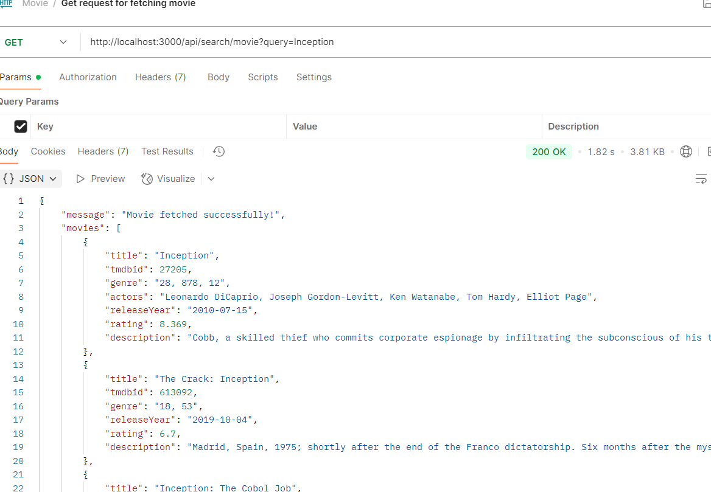
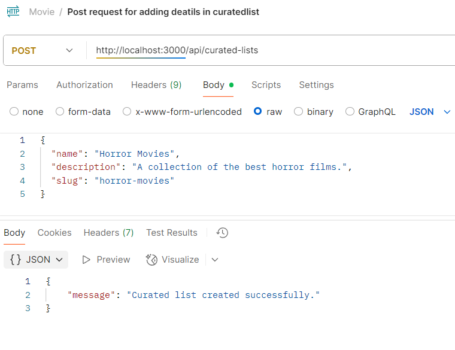

MovieHunt 🎬

MovieHunt is a modern web application for discovering, managing, and exploring movies, built with Node.js, Express, Sequelize, and PostgreSQL. It provides APIs to handle movie data, including details, genres, cast, crew, and more.

---

Features

    Create, read, update, and delete movie entries

    Support for movie genres, cast, and crew management

    PostgreSQL database integration via Sequelize ORM

    RESTful API endpoints for frontend consumption

---

---
Getting Started
Prerequisites

    Node.js v14+

    PostgreSQL database

    npm or yarn package manager

Installation

    Clone the repository:

    git clone https://github.com/yourusername/moviehunt.git
    cd moviehunt

Install dependencies:
    npm install

---

Set up environment variables:

Create a .env file at the root with the following variables:

     DB_NAME=your_database_name
     DB_USER=your_database_user
     DB_PASS=your_database_password
     DB_HOST=localhost
     PORT=3000
     CLOUDINARY_CLOUD_NAME=your_cloud_name (if using Cloudinary)
     CLOUDINARY_API_KEY=your_api_key
     CLOUDINARY_API_SECRET=your_api_secret
---

Run migrations and seed database (if applicable):

npx sequelize db:migrate
npx sequelize db:seed:all

---

## 📚 API Endpoints

| Method | Endpoint          | Description             |
|--------|-------------------|-------------------------|
| GET    | `/api/movies`     | Get all movies          |
| GET    | `/api/movies/:id` | Get movie details by ID |
| POST   | `/api/movies`     | Create a new movie      |
| PUT    | `/api/movies/:id` | Update movie details    |
| DELETE | `/api/movies/:id` | Delete a movie          |

---

